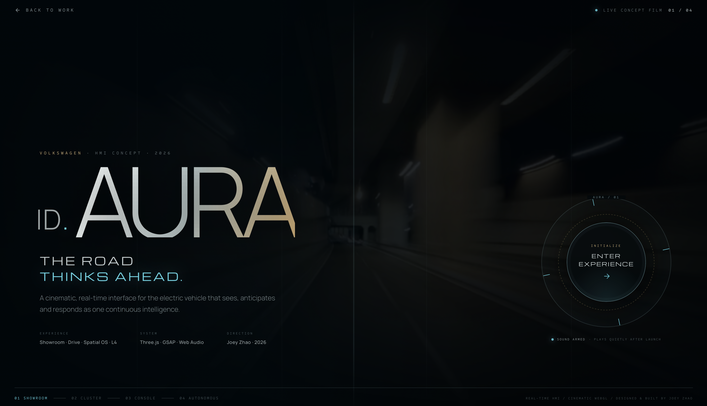

<h1 align="center">Joey Zhao</h1>

  <strong>Designing the feeling. Shipping the system.</strong> 
  <em>把体验做得有感觉，把想法做成真正能用的产品。</em>

  <a href="https://joeyzhao.cc">Portfolio</a> ·
  <a href="https://www.linkedin.com/in/joey-zhao-b8576b91/">LinkedIn</a> ·
  <a href="mailto:super666joey@gmail.com">Email</a> ·
  <a href="https://github.com/joeymilano?tab=followers">Follow</a>

---

I’m a product designer and AI builder who takes ideas from **first question to real product** — shaping the strategy, interaction, visual language, frontend, and the AI behavior behind it. My work spans [**@joeymilano**](https://github.com/joeymilano) and [**@JoeyZhaoUX**](https://github.com/JoeyZhaoUX): AI-native products, consumer tools, browser extensions, and expressive digital experiences.

我是产品设计师，也是 AI Builder。我把一个模糊但有野心的想法，推进到真实用户愿意使用的产品：从产品判断、交互与视觉，到前端实现和 AI 能力，全部落到同一套高标准里。我的作品横跨 [**@joeymilano**](https://github.com/joeymilano) 与 [**@JoeyZhaoUX**](https://github.com/JoeyZhaoUX)，涵盖 AI 原生产品、消费级工具、浏览器扩展与富有表达力的数字体验。

> **No theatre decks. No fake demos. Just products with a point of view — and the craft to make them real.**  
> **不做只停留在 PPT 里的“概念产品”。我关心的是有立场、有体验、有真实生命力的产品。**

## Featured interaction / 旗舰体验

  

### [ID.AURA — Volkswagen HMI Concept ↗](https://joeyzhao.cc/vw-id-aura/)

**The road thinks ahead.** An independent, real-time WebGL concept for Volkswagen's electric future — a vehicle experience that sees, anticipates, and responds as one continuous intelligence. I designed and built the complete experience across **Showroom · Cluster · Spatial Console · Autonomous**.

为大众电动未来打造的独立 HMI 概念：以实时 WebGL 将展车、仪表、空间中控与自动驾驶串成一个连续的智能体验。从体验策略、视觉语言到前端与交互，全部由我设计并实现。

  <a href="https://joeyzhao.cc/vw-id-aura/"><strong>Launch the experience ↗</strong></a>
  &nbsp;·&nbsp;
  <a href="https://github.com/joeymilano/portfolio.github.io/tree/main/vw-id-aura">Explore the build ↗</a>

---

## Selected work / 代表作品

| | Product | Why it matters / 它解决什么 |
| --- | --- | --- |
| ✦ | [**Finfold**](https://github.com/joeymilano/Finfold) | An AI content growth OS for solo founders going global — turning one insight into native content for RED, X, LinkedIn, Reddit, and beyond. 为出海独立创业者打造的 AI 内容增长系统：一次输入，多平台原生表达。 |
| ✦ | [**Bill Vampire**](https://github.com/JoeyZhaoUX/Bill-Vampire) + [**Gmail Patrol**](https://github.com/JoeyZhaoUX/bill-vampire-extension) | A privacy-first subscription-defense product and its Gmail companion: identify recurring charges, assess risk, and turn billing evidence into an actionable response. 一个隐私优先的订阅防御产品及其 Gmail 扩展：识别续费、判断风险，并将账单证据转化为可执行的应对方案。 |
| ✦ | [**The Forgetting Engine**](https://github.com/joeymilano/forgetting-engine) | A poetic interaction that turns a memory into weathered words, then lets it scatter — proof that utility and emotion can coexist. 把记忆风化成诗，再让它消散；功能与情绪不必二选一。 |
| ✦ | [**SoundPoetry**](https://github.com/JoeyZhaoUX/sound-poetry) | An audio-reactive poetry experience where voice and ambient sound become a visual, participatory canvas. 让声音与环境音变成可参与、可感知的诗意视觉体验。 |
| ✦ | [**EcoLoop**](https://github.com/JoeyZhaoUX/ecoloop-client-delivery) | A sustainable-living gamification experience that makes everyday low-impact choices motivating and visible. 用游戏化体验，让日常可持续选择更有动力，也更看得见。 |
| ✦ | [**Portfolio & Writing**](https://joeyzhao.cc) | Product thinking, experiments, and the work behind the work. 产品思考、实验和那些真正决定作品质量的细节。 |

  AI-native products · Consumer tools · Expressive interaction · WebGL systems

## My operating system / 我的工作方式

- **Start with behavior, not decoration.** Find the decision, friction, and feeling that actually move a person.  
  **先理解行为，再谈视觉。** 找到真正影响用户决策、阻力与情绪的地方。

- **Make ambiguity tangible fast.** Prototype early, test the edge cases, and let the product answer the question.  
  **快速把模糊变成可感知的东西。** 尽早原型化、处理边界情况，让产品自己回答问题。

- **Hold the whole experience to one bar.** Product, brand, interface, code, and AI behavior should feel like they came from one mind.  
  **用同一个标准要求整体体验。** 产品、品牌、界面、代码和 AI 行为，应当像出自同一个大脑。

## Currently / 现在

Building AI-native products, evolving Finfold, and exploring how software can be both **useful** and **unforgettable**.

正在持续构建 AI 原生产品、迭代 Finfold，也在探索软件如何同时做到 **有用** 与 **令人难忘**。

---

  <strong>If you care about products that earn attention by being genuinely better, let’s talk.</strong> 
  <em>如果你也相信，真正更好的产品会自己赢得注意力，欢迎来聊。</em>

