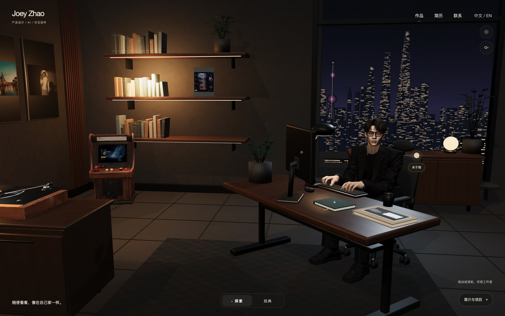

<h1 align="center">Joey Zhao</h1>

  <strong>Designing the feeling. Shipping the system.</strong> 
  <em>把体验做得有感觉，把想法做成真正能用的产品。</em>

  <a href="https://joeyzhao.cc">Portfolio</a> ·
  <a href="https://www.linkedin.com/in/joey-zhao-b8576b91/">LinkedIn</a> ·
  <a href="mailto:super666joey@gmail.com">Email</a> ·
  <a href="https://github.com/joeymilano?tab=followers">Follow</a>

---

I’m a product designer and AI builder who takes ideas from **first question to real product** — shaping the strategy, interaction, visual language, frontend, and the AI behavior behind it. My work spans [**@joeymilano**](https://github.com/joeymilano) and [**@JoeyZhaoUX**](https://github.com/JoeyZhaoUX): AI-native products, consumer tools, browser extensions, and expressive digital experiences.

我是产品设计师，也是 AI Builder。我把一个模糊但有野心的想法，推进到真实用户愿意使用的产品：从产品判断、交互与视觉，到前端实现和 AI 能力，全部落到同一套高标准里。我的作品横跨 [**@joeymilano**](https://github.com/joeymilano) 与 [**@JoeyZhaoUX**](https://github.com/JoeyZhaoUX)，涵盖 AI 原生产品、消费级工具、浏览器扩展与富有表达力的数字体验。

> **No theatre decks. No fake demos. Just products with a point of view — and the craft to make them real.**  
> **不做只停留在 PPT 里的“概念产品”。我关心的是有立场、有体验、有真实生命力的产品。**

## Featured interaction / 旗舰体验

  

### [The Interactive Studio — Explore Mode ↗](https://joeyzhao.cc/explore/)

**A portfolio you walk into, not one you scroll.** Explore mode turns joeyzhao.cc into a real-time WebGL studio: look around by drag, scroll, or arrow keys, and click the room's objects — the arcade, the bookshelf, the camera, the notebook — to open the work where it lives. Eight exhibits inside, day/night themes, ambient sound, full EN/中文, and a classic view for readers in a hurry. Scene, interaction, copy, and code — one maker.

我的网站现在可以“走进去”看：「探索模式」把 joeyzhao.cc 变成一间实时 WebGL 工作室：拖动、滚轮或方向键环视夜景房间，点击屋里的物件——街机、书架、相机、笔记本——作品就在它该在的地方打开。馆内八件展品，支持日/夜主题、环境声与中英双语；赶时间的话还有「经典模式」。从 3D 场景、交互、文案到代码，全部由我一人完成。

  <a href="https://joeyzhao.cc/explore/"><strong>Walk into the studio ↗</strong></a>
  &nbsp;·&nbsp;
  <a href="https://github.com/joeymilano/portfolio.github.io/tree/main/explore">Explore the build ↗</a>

Inside the studio / 馆内展品：Finfold · Signals Notebook · CollovGPT · UnifyUX · Ctrip Hotel · <a href="https://joeyzhao.cc/vw-id-aura/">ID.AURA</a> · Borrowed Light · CALL ME YAO

---

## Selected work / 代表作品

| | Product | Why it matters / 它解决什么 |
| --- | --- | --- |
| ✦ | [**Finfold**](https://github.com/joeymilano/Finfold) | An AI content growth OS for solo founders going global — turning one insight into native content for RED, X, LinkedIn, Reddit, and beyond. 为出海独立创业者打造的 AI 内容增长系统：一次输入，多平台原生表达。 |
| ✦ | [**Bill Vampire**](https://github.com/JoeyZhaoUX/Bill-Vampire) + [**Gmail Patrol**](https://github.com/JoeyZhaoUX/bill-vampire-extension) | A privacy-first subscription-defense product and its Gmail companion: identify recurring charges, assess risk, and turn billing evidence into an actionable response. 一个隐私优先的订阅防御产品及其 Gmail 扩展：识别续费、判断风险，并将账单证据转化为可执行的应对方案。 |
| ✦ | [**PORTFOLIO OS**](https://joeymilano.github.io/portfolio-os/) | A design-education AI agent that plans study-abroad portfolios like a strategist — built for the Alipay Agent Award, deployed and live. 支付宝智能体涌现奖参赛作：像留学策略师一样帮设计学生规划作品集的 AI 智能体，已部署上线。 |
| ✦ | [**CALL ME YAO 妖**](https://joeyzhao.cc/yao/) | An AI-native girl group of four Journey to the West demons — one person, 36 scripts, from lyrics to YouTube release. 把《西游记》四只妖怪重组成 AI 原生女团：一个人、36 版脚本，从作词到 YouTube 上线的完整影像管线。 |
| ✦ | [**Finfold Growth Mission**](https://github.com/xagentAI/xagt-plugin/pull/34) | A Finfold-powered growth-mission plugin, merged into xagentAI/xagt-plugin — shipping agent workflows where agents live. 基于 Finfold 的增长任务插件，已合并进 xagentAI/xagt-plugin 官方仓库：把增长工作流直接送进智能体平台。 |
| ✦ | [**Portfolio & Writing**](https://joeyzhao.cc) | Product thinking, experiments, and the work behind the work. 产品思考、实验和那些真正决定作品质量的细节。 |

  AI-native products · Consumer tools · Expressive interaction · WebGL systems

## My operating system / 我的工作方式

- **Start with behavior, not decoration.** Find the decision, friction, and feeling that actually move a person.  
  **先理解行为，再谈视觉。** 找到真正影响用户决策、阻力与情绪的地方。

- **Make ambiguity tangible fast.** Prototype early, test the edge cases, and let the product answer the question.  
  **快速把模糊变成可感知的东西。** 尽早原型化、处理边界情况，让产品自己回答问题。

- **Hold the whole experience to one bar.** Product, brand, interface, code, and AI behavior should feel like they came from one mind.  
  **用同一个标准要求整体体验。** 产品、品牌、界面、代码和 AI 行为，应当像出自同一个大脑。

## Currently / 现在

Building AI-native products, evolving Finfold, and exploring how software can be both **useful** and **unforgettable**.

正在持续构建 AI 原生产品、迭代 Finfold，也在探索软件如何同时做到 **有用** 与 **令人难忘**。

---

  <strong>If you care about products that earn attention by being genuinely better, let’s talk.</strong> 
  <em>如果你也相信，真正更好的产品会自己赢得注意力，欢迎来聊。</em>

